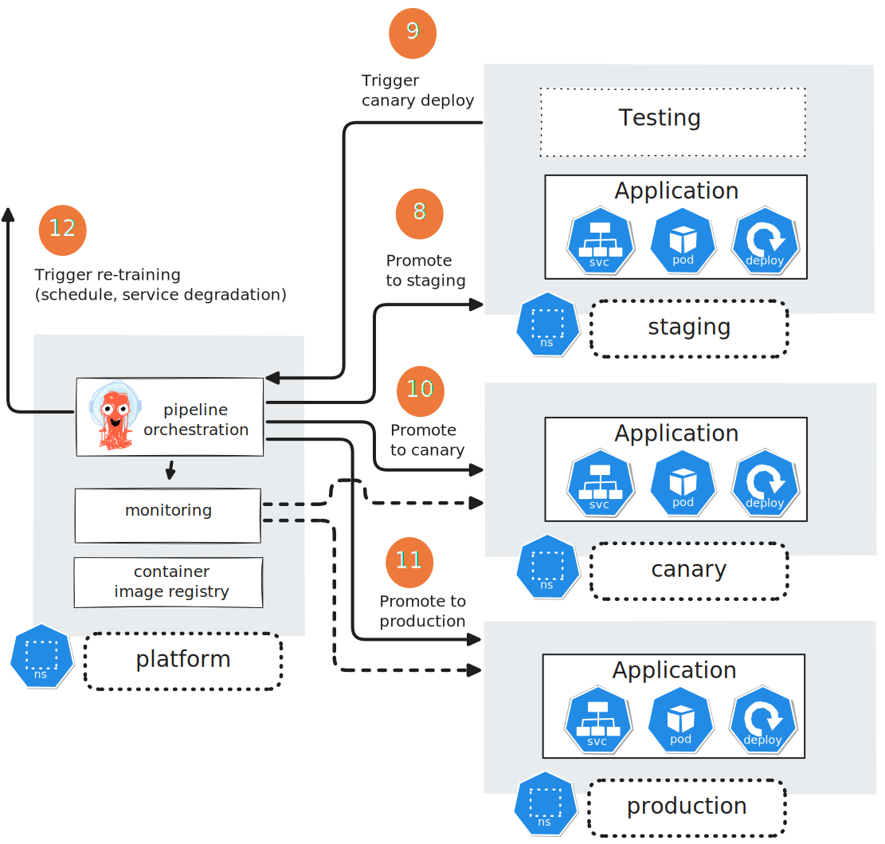

# Build an MLOps Pipeline

In [Cloud Computing on Chameleon](https://teaching-on-testbeds.github.io/cloud-chi/), following the premise:

> You are working at a machine learning engineer at a small startup company called GourmetGram. They are developing an online photo sharing community focused on food. You are testing a new model you have developed that automatically classifies photos of food into one of a set of categories: Bread, Dairy product, Dessert, Egg, Fried food, Meat, Noodles/Pasta, Rice, Seafood, Soup, and Vegetable/Fruit. You have built a simple web application with which to test your model and get feedback from others.

we deployed a basic machine learning service to an OpenStack cloud. However, that deployment involved a lot of manual steps ("ClickOps"), and any updates to it would similarly involve lots of manual effort, be difficult to track, etc.

In this tutorial, we will learn how to automate both the initial deployment, and updates during the lifecycle of the application. We will:

* practice deploying systems following infrastructure-as-code and configuration-as-code principles using automated deployment tools
* and create an automated pipeline to manage a machine learning model through its lifecycle 

Our experiment will use the following automated deployment and lifecycle management tools:

* Terraform: A declarative Infrastructure as Code (IaC) tool used to provision and manage cloud infrastructure (servers, networks, etc.) by defining the desired end state in configuration files. Here, we use it to provision our infrastructure.
* Ansible: An imperative Configuration as Code (CaC) tool that automates system configuration, software installation, and application deployment through task-based YAML playbooks describing the steps to achieve a desired setup. Here, we use it to install Kubernetes and the Argo tools on our infrastructure after it is provisioned
* Argo CD: A declarative GitOps continuous delivery tool for Kubernetes that automatically syncs and deploys applications based on the desired state stored in Git repositories.
* Argo Workflows: A Kubernetes-native workflow engine where you define workflows, which execute tasks inside containers to run pipelines, jobs, or automation processes.

**Note**: that we use Argo CD and Argo Workflows, which are tightly integrated with Kubernetes, because we are working in the context of a Kubernetes deployment. If our service was not deployed in Kubernetes (for example: it was deployed using "plain" Docker containers without a container orchestration framework), we would use other tools for managing the application and model lifecycle.

To run this experiment, you should have already created an account on Chameleon, and become part of a project. You should also have added your SSH key to the KVM@TACC site.


## Experiment topology 

In this experiment, we will deploy a 3-node Kubernetes cluster on Chameleon instances. The Kubernetes cluster will be self-managed, which means that the infrastructure provider is not responsbile for setting up and maintaining our cluster; *we* are.  

However, the cloud infrastructure provider will provide the compute resources and network resources that we need. We will provision the following resources for this experiment:


## Provision a key

Before you begin, open this experiment on Trovi:

* Use this link: [MLOps Pipeline](https://chameleoncloud.org/experiment/share/1eb302de-4707-4ae9-ae2d-391b9b8e5261) on Trovi
* Then, click “Launch on Chameleon”. This will start a new Jupyter server for you, with the experiment materials already in it.

You will see several notebooks inside the `mlops-chi` directory - look for the one titled `0_intro.ipynb`. Open this notebook and execute the following cell (and make sure the correct project is selected):


```python
# runs in Chameleon Jupyter environment
from chi import server, context

context.version = "1.0" 
context.choose_project()
context.choose_site(default="KVM@TACC")
```

```python
# runs in Chameleon Jupyter environment
server.update_keypair()
```


Then, you may continue following along at [Build an MLOps Pipeline](https://teaching-on-testbeds.github.io/mlops-chi/).


## Prepare the environment

In keeping with good DevOps practices, we will deploy our infrastructure - starting with the Kubernetes cluster - using infrastructure-as-code and configuration-as-code principles:

* The process of provisioning and deploying the infrastructure is scalable, because it is heavily automated. It is easy to rebuild the system, without requiring effort or expertise.
* Everything needed to deploy the infrastructure is in version control.
* The infrastructure is immutable - no manual updates or changes.

We will use two IaC/CaC tools to prepare our Kubernetes cluster: 

* [Terraform](https://www.terraform.io/), which we'll use to provision the resources on our cloud infrastructure provider. (A popular alternative is [OpenTofu](https://opentofu.org/).)
* [Ansible](https://github.com/ansible/ansible), which we'll use to configure and deploy Kubernetes, and then to set up the Kubernetes cluster and the services running on it. (A popular alternative is [Salt](https://github.com/saltstack/salt).)

both of which are aligned with the principles above.

In this notebook, which will run in the Chameleon Jupyter environment, we will install and configure these tools in that environment. This is a *one-time* step that an engineer would ordinarily do just once, on their own computer.

> **Note**: This is a Bash notebook, so you will run it with a Bash kernel. You can change the kernel (if needed) by clicking the kernel name in the top right of the Jupyter interface.


### Get infrastructure configuration


Following IaC principles, our infrastructure configuration is all in version control! We have organized all of the materials that "describe" the deployment in our "IaC repository": [https://github.com/teaching-on-testbeds/gourmetgram-iac.git](https://github.com/teaching-on-testbeds/gourmetgram-iac.git). 

This repository has the following structure:


```
├── tf
│   └── kvm
├── ansible
│   ├── general
│   ├── pre_k8s
│   ├── k8s
│   ├── post_k8s
│   └── argocd
├── k8s
│   ├── platform
│   ├── staging
│   ├── canary
│   └── production
└── workflows
```

* The `tf` directory includes materials needed for Terraform to provision resources from the cloud provider. This is a "Day 0" setup task.
* The "Day 1" setup task is to install and configure Kubernetes on the resources. We use Ansible, and the materials are in the `ansible` directory in the `pre_k8s`, `k8s` and `post_k8s` subdirectories. (The `general` directory is just for learning.)
* The applications that we will be deployed in Kubernetes are defined in the `k8s` directory:
  * `platform` has all the "accessory" services we need to support our machine learning application. In this example, it has a model registry and the associated database and object store services used by the model registry; more generally "platform" may include experiment tracking, evaluation and monitoring, and other related services.
  * `staging`, `canary`, and `production` are deployments of our GourmetGram application. A new model or application version starts off in `staging`; after some internal tests it may be promoted to `canary` where it is served to some live users; and after further evaluation and monitoring, it may be promoted to `production`. 
* We use Ansible to "register" these applications in ArgoCD, using the playbooks in the `ansible/argocd` directory. ArgoCD is a continuous delivery tool for Kubernetes that automatically deploys and updates applications based on the latest version of its manifests.
* From "Day 2" and on, during the lifecycle of the application, we use ArgoCD and Argo Workflows to handle model and application versions, using the pipelines in `workflows`.


In the next cell, we get a copy of the [GourmetGram infrastructure repository](https://github.com/teaching-on-testbeds/gourmetgram-iac.git):


```bash
# runs in Chameleon Jupyter environment
git clone --recurse-submodules https://github.com/teaching-on-testbeds/gourmetgram-iac.git /work/gourmetgram-iac
```


Note that we use the `--recurse-submodules` argument to `git clone` - we are including Kubespray, an Ansible-based project for deploying Kubernetes, inside our IaC repository as a submodule.


Among the automation and CI/CD tools mentioned above:

* Terraform and Ansible run on the engineer's own computer, and communicate with the cloud provider/cloud resources over a network. 
* ArgoCD and Argo Workflows run on the cloud resources themselves.

So, a necessary prerequisite for this workflow is to download, install, and configure Terraform and Ansible on "our own computer" - except in this case, we will use the Chameleon Jupyter environment as "our computer".


### Install and configure Terraform


Before we can use Terraform, we'll need to download a Terraform client. The following cell will download the Terraform client and "install" it in this environment:


```bash
# runs in Chameleon Jupyter environment
mkdir -p /work/.local/bin
wget https://releases.hashicorp.com/terraform/1.10.5/terraform_1.10.5_linux_amd64.zip
unzip -o -q terraform_1.10.5_linux_amd64.zip
mv terraform /work/.local/bin
rm terraform_1.10.5_linux_amd64.zip
```


The Terraform client has been installed to: `/work/.local/bin`. In order to run `terraform` commands, we will have to add this directory to our `PATH`, which tells the system where to look for executable files.


```bash
# runs in Chameleon Jupyter environment
export PATH=/work/.local/bin:$PATH
```


Let's make sure we can now run `terraform` commands. The following cell should print usage information for the `terraform` command, since we run it without any subcommands:


```bash
# runs in Chameleon Jupyter environment
terraform
```


Terraform works by communicating with a cloud provider (either a commercial cloud, like AWS or GCP, or a private cloud, like an on-premises OpenStack cloud, or a hybrid cloud with both types of resources). We will need to prepare credentials with which it can act on our behalf on the Chameleon OpenStack cloud. This is a one-time procedure.

To get credentials, open the Horizon GUI:

* from the Chameleon website
* click "Experiment" > "KVM@TACC"
* log in if prompted to do so
* check the project drop-down menu near the top left (which shows e.g. “CHI-XXXXXX”), and make sure the correct project is selected.

On the left side, expand the "Identity" section and click on "Application Credentials". Then, click "Create Application Credential".

* In the "Name", field, use "mlops-lab".
* Set the "Expiration" date and time to the due date of this lab. (Note that this will be in UTC time, not your local time zone.) This ensures that if your credential is leaked (e.g. you accidentially push it to a public Github repository), the damage is mitigated.
* Click "Create Application Credential".
* Choose "Download clouds.yaml".


The `clouds.yaml` file will look something like this (expect with an alphanumeric string in place of `REDACTED_UNIQUE_ID` and `REDACTED_SECRET`):

```
clouds:
  openstack:
    auth:
      auth_url: https://kvm.tacc.chameleoncloud.org:5000
      application_credential_id: "REDACTED_UNIQUE_ID"
      application_credential_secret: "REDACTED_SECRET"
    region_name: "KVM@TACC"
    interface: "public"
    identity_api_version: 3
    auth_type: "v3applicationcredential"
```

It lists one or more clouds - in this case, a single cloud named "openstack", and then for each cloud, specifies how to connect and authenticate to that cloud. In particular, the `application_credential_id` and `application_credential_secret` allow an application like Terraform to interact with the Chameleon cloud on your behalf, without having to use your personal Chameleon login.

Then, in our Terraform configuration, we will have a block like

```
provider "openstack" {
  cloud = "openstack"
}
```

where the value assigned to `cloud` tells Terraform which cloud in the `clouds.yaml` file to authenticate to.


One nice feature of Terraform is that we can use it to provision resource on multiple clouds. For example, if we wanted to provision resources on both KVM@TACC and CHI@UC (e.g. the training resources on CHI@UC and everything else on KVM@TACC), we might generate application credentials on both sites, and combine them into a `clouds.yaml` like this:

```
clouds:
  kvm:
    auth:
      auth_url: https://kvm.tacc.chameleoncloud.org:5000
      application_credential_id: "REDACTED_UNIQUE_ID_KVM"
      application_credential_secret: "REDACTED_SECRET_KVM"
    region_name: "KVM@TACC"
    interface: "public"
    identity_api_version: 3
    auth_type: "v3applicationcredential"
  uc:
    auth:
      auth_url: https://chi.uc.chameleoncloud.org:5000
      application_credential_id: "REDACTED_UNIQUE_ID_UC"
      application_credential_secret: "REDACTED_SECRET_UC"
    region_name: "CHI@UC"
    interface: "public"
    identity_api_version: 3
    auth_type: "v3applicationcredential"

```

and then in our Terraform configuration, we could specify which OpenStack cloud to use, e.g.

```
provider "openstack" {
  cloud = "kvm"
}
```

or 


```
provider "openstack" {
  cloud = "uc"
}
```

For now, since we are just using one cloud, we will leave our `clouds.yaml` as is.


In the file browser in the Chameleon Jupyter environment, you will see a template `clouds.yaml`.  Use the file browser to open it, and paste in the 

```
      application_credential_id: "REDACTED_UNIQUE_ID"
      application_credential_secret: "REDACTED_SECRET"
```

lines from the `clouds.yaml` that you just downloaded from the KVM@TACC GUI (so that it has the "real" credentials in it). Save the file.


Terraform will look for the `clouds.yaml` in either ` ~/.config/openstack` or the directory from which we run `terraform` - we will move it to the latter directory:


```bash
# runs in Chameleon Jupyter environment
cp clouds.yaml /work/gourmetgram-iac/tf/kvm/clouds.yaml
```


### Install and configure Ansible


Next, we'll set up Ansible! We will similarly need to get the Ansible client, which we install in the following cell:


```bash
# runs in Chameleon Jupyter environment
PYTHONUSERBASE=/work/.local pip install --user ansible-core==2.16.9 ansible==9.8.0
```


The Ansible client has been installed to: `/work/.local/bin`. In order to run `ansible-playbook` commands, we will have to add this directory to our `PATH`, which tells the system where to look for executable files. We also need to let it know where to find the corresponding Python packages.


```bash
# runs in Chameleon Jupyter environment
export PATH=/work/.local/bin:$PATH
export PYTHONUSERBASE=/work/.local
```


Let's make sure we can now run `ansible-playbook` commands. The following cell should print usage information for the `ansible-playbook` command, since we run it with `--help`:


```bash
# runs in Chameleon Jupyter environment
ansible-playbook --help
```


Now, we'll configure Ansible. The `ansible.cfg` configuration file modifies the default behavior of the Ansible commands we're going to run. Open this file using the file browser on the left side.


Our configuration will include:

```
[defaults]
stdout_callback = yaml
inventory = /work/gourmetgram-iac/ansible/inventory.yaml

```

The first line is just a matter of preference, and directs the Ansible client to display output from commands in a more structured, readable way. The second line specifies the location of a default *inventory* file - the list of hosts that Ansible will configure.

It will also include:

```
[ssh_connection]
ssh_args = -o StrictHostKeyChecking=off -o UserKnownHostsFile=/dev/null -o ForwardAgent=yes -o ProxyCommand="ssh -o StrictHostKeyChecking=no -o UserKnownHostsFile=/dev/null -W %h:%p cc@A.B.C.D"
```

which says that when Ansible uses SSH to connect to the resources it is managing, it should "jump" through `A.B.C.D` and forward the keys from this environment, through `A.B.C.D`, to the final destination. (Also, we disable host key checking when using SSH.)

You will need to edit `A.B.C.D.` *after* you provision your resources, and replace it with the floating IP assigned to your experiment.

*After* you have edited the floating IP and saved the `ansible.cfg` file, you can move it - Ansible will look in either `~/.ansible.cfg` or the directory that we run Ansible commands from, we will use the latter:


```bash
# runs in Chameleon Jupyter environment
# ONLY AFTER YOU HAVE PROVISIONED RESOURCES AND UPDATED THE CFG
cp ansible.cfg /work/gourmetgram-iac/ansible/ansible.cfg
```


### Configure the PATH


Both Terraform and Ansible executables have been installed to a location that is not the system-wide location for executable files: `/work/.local/bin`. In order to run `terraform` or `ansible-playbook` commands, we will have to add this directory to our `PATH`, which tells the system where to look for executable files.


```bash
# runs in Chameleon Jupyter environment
export PATH=/work/.local/bin:$PATH
export PYTHONUSERBASE=/work/.local
```


and, we'll have to do that in *each new Bash session*.


### Prepare Kubespray

To install Kubernetes, we'll use Kubespray, which is a set of Ansible playbooks for deploying Kubernetes. We'll also make sure we have its dependencies now:


```bash
# runs in Chameleon Jupyter environment
PYTHONUSERBASE=/work/.local pip install --user -r /work/gourmetgram-iac/ansible/k8s/kubespray/requirements.txt
```


## Provision infrastructure with Terraform

Now that everything is set up, we are ready to provision our VM resources with Terraform! We will use Terraform to provision 3 VM instances and associated network resources on the OpenStack cloud.


### Preliminaries


Let's navigate to the directory with the Terraform configuration for our KVM deployment:


```bash
# runs in Chameleon Jupyter environment
cd /work/gourmetgram-iac/tf/kvm
```


and make sure we'll be able to run the `terraform` executable by adding the directory in which it is located to our `PATH`:


```bash
# runs in Chameleon Jupyter environment
export PATH=/work/.local/bin:$PATH
```


We also need to un-set some OpenStack-related environment variables that are set automatically in the Chameleon Jupyter environment, since these will override some Terraform settings that we *don't* want to override:


```bash
# runs in Chameleon Jupyter environment
unset $(set | grep -o "^OS_[A-Za-z0-9_]*")
```


We should also check that our `clouds.yaml` is set up:


```bash
# runs in Chameleon Jupyter environment
cat  clouds.yaml
```


### Understanding our Terraform configuration


The `tf/kvm` directory in our IaC repository includes the following files, which we'll briefly discuss now.

```
├── data.tf
├── main.tf
├── outputs.tf
├── provider.tf
├── variables.tf
└── versions.tf
```

A Terraform configuration defines infrastructure elements using stanzas, which include different components such as 

* data sources (see `data.tf`)
* resources, (ours are in `main.tf`)
* outputs, (see `outputs.tf`)
* one or more providers (see `providers.tf`) with reference to providers listed in our `clouds.yaml`,
* variables, (see `variables.tf`)
* and by convention there is a `versions.tf` which describes what version of Terraform and what version of the OpenStack plugin for Terraform our configuration is defined for. 

We'll focus especially on data sources, resources, outputs, and variables. Here's an example of a Terraform configuration that includes all four:

```
resource "openstack_compute_instance_v2" "my_vm" {
  name            = "${var.instance_hostname}"
  flavor_name     = "m1.small"
  image_id        = data.openstack_images_image_v2.ubuntu.id
  key_pair        = "my-keypair"
  network {
    name = "private-network"
  }
}

data "openstack_images_image_v2" "ubuntu" {
  name = "CC-Ubuntu24.04"
}

variable "instance_hostname" {
  description = "Hostname to use for the image"
  type        = string
  default     = "example-vm"
}

output "instance_ip" {
  value = openstack_compute_instance_v2.my_vm.access_ip_v4
}
```

Each item is in a **stanza** which has a block type, an identifier, and a body enclosed in curly braces {}. For example, the resource stanza for the OpenStack instance above has the block type `resource`, the resource type `openstack_compute_instance_v2`, and the name `my_vm`. (This name can be anything you want - it is used to refer to the resource elsewhere in the configuration.) Inside the body, we would specify attributes such as `flavor_name`, `image_id`, and `network` (you can see a complete list in the [documentation](https://registry.terraform.io/providers/terraform-provider-openstack/openstack/latest/docs/resources/compute_instance_v2)).

The data sources, variables, and resources are used to define and manage infrastructure. 

* **data** sources get existing infrastructure details from OpenStack about resources *not* managed by Terraform, e.g. available images or flavors. For example, here we had a data stanza of type "openstack_images_image_v2" with name "ubuntu". Terraform will get the details of this image from the OpenStack provider; then, when we use `data.openstack_images_image_v2.ubuntu.id` in defining the resource, it knows the ID of the image without us having to look it up. (Note that we can refer to another part of the Terraform file using `block_type.resource_type.name`, e.g. `data.openstack_images_image_v2.ubuntu` here.) You can look at our `data.tf` and see that we are asking Terraform to find out about the existing `sharednet1` network, its associated subnet, and several security groups.
* **variables** let us define inputs and reuse the configuration across different environments. The value of variables can be passed in the command line arguments when we run a `terraform` command, or by defining environment variables that start with `TF_VAR`. In this example, there's a variable `instance_hostname` so that we can re-use this configuration to create a VM with any hostname - the variable is used inside the resource block with `name = "${var.instance_hostname}"`. If you look at our `variables.tf`, you can see that we'll use variables to define a suffix to include in all our resource names (e.g. your net ID), and the name of your key pair.
* **resources** represent actual OpenStack components such as compute instances, networks, ports, floating IPs, and security groups. You can see the types of resources available in the [documentation](https://registry.terraform.io/providers/terraform-provider-openstack/openstack/latest/docs). Our resoures are defined in `main.tf`.


You may notice the use of `for_each` in `main.tf`. This is used to iterate over a collection, such as a map variable, to create multiple instances of a resource. Since `for_each` assigns unique keys to each element, that makes it easier to reference specific resources. For example, we provision a port on `sharednet1` for each instance, but when we assign a floating IP, we can specifically refer to the port for "node1" with `openstack_networking_port_v2.sharednet1_ports["node1"].id`.

Terraform also supports outputs, which provide information about the infrastructure after deployment. For example, if we want to print a dynamically assigned floating IP after the infrastructure is deployed, we might put it in an output. This will save us from having to look it up in the Horizon GUI. You can see in `outputs.tf` that we do exactly this.

Terraform is *declarative*, not imperative, so we don't need to write the exact steps needed to provision this infrastructure - Terraform will examine our configuration and figure out a plan to realize it.


### Applying our Terraform configuration


First, we need Terraform to set up our working directory, make sure it has "provider" plugins to interact with our infrastructure provider (it will read in `provider.tf` to check), and set up storage for keeping track of the infrastructure state:


```bash
# runs in Chameleon Jupyter environment
terraform init
```


We need to set some [variables](https://developer.hashicorp.com/terraform/language/values/variables). In our Terraform configuration, we define a variable named `suffix` that we will substitute with our own net ID, and then we use that variable inside the hostname of instances and the names of networks and other resources in `main.tf`, e.g. we name our network <pre>private-subnet-mlops-<b>${var.suffix}</b></pre>. We'll also use a variable to specify a key pair to install.

In the following cell, **replace `netID` with your actual net ID, and replace `id_rsa_chameleon` with the name of *your* personal key that you use to access Chameleon resources**.


```bash
# runs in Chameleon Jupyter environment
export TF_VAR_suffix=netID
export TF_VAR_key=id_rsa_chameleon
```


We should confirm that our planned configuration is valid:


```bash
# runs in Chameleon Jupyter environment
terraform validate
```


Then, let's preview the changes that Terraform will make to our infrastructure. In this stage, Terraform communicates with the cloud infrastructure provider to see what have *already* deployed and to 


```bash
# runs in Chameleon Jupyter environment
terraform plan
```


Finally, we will apply those changes. (We need to add an `-auto-approve` argument because ordinarily, Terraform prompts the user to type "yes" to approve the changes it will make.)


```bash
# runs in Chameleon Jupyter environment
terraform apply -auto-approve
```


Make a note of the floating IP assigned to your instance, from the Terraform output.


From the KVM@TACC Horizon GUI, check the list of compute instances and find yours. Take a screenshot for later reference.


### Changing our infrastructure


One especially nice thing about Terraform is that if we change our infrastructure definition, it can apply those changes without having to re-provision everything from scratch. 


For example, suppose the physical node on which our "node3" VM becomes non-functional. To replace our "node3", we can simply run


```bash
# runs in Chameleon Jupyter environment
terraform apply -replace='openstack_compute_instance_v2.nodes["node3"]' -auto-approve
```


Similarly, we could make changes to the infrastructure description in the `main.tf` file and then use `terraform apply` to update our cloud infrastructure. Terraform would determine which resources can be updated in place, which should be destroyed and recreated, and which should be left alone.

This declarative approach - where we define the desired end state and let the tool get there - is much more robust than imperative-style tools for deploying infrastructure (`openstack` CLI, `python-chi` Python API) (and certainly more robust than ClickOps!).


## Practice using Ansible

Now that we have provisioned some infrastructure, we can configure and install software on it using Ansible! 

Ansible is a tool for configuring systems by accessing them over SSH and running commands on them. The commands to run will be defined in advance in a series of *playbooks*, so that instead of using SSH directly and then running commands ourselves interactively, we can just execute a playbook to set up our systems.

First, let's just practice using Ansible.


### Preliminaries


As before, let's make sure we'll be able to use the Ansible executables. We need to put the install directory in the `PATH` inside each new Bash session.


```bash
# runs in Chameleon Jupyter environment
export PATH=/work/.local/bin:$PATH
export PYTHONUSERBASE=/work/.local
```


If you haven't already, make sure to put your floating IP (which you can see in the output of the Terraform command!) in the `ansible.cfg` configuration file, and move it to the specified location.

The following cell will show the contents of this file, so you can double check - make sure your real floating IP is visible in this output!


```bash
# runs in Chameleon Jupyter environment
cat /work/gourmetgram-iac/ansible/ansible.cfg
```


Finally, we'll `cd` to that directory - 


```bash
# runs in Chameleon Jupyter environment
cd /work/gourmetgram-iac/ansible
```


### Verify connectivity

First, we'll run a simple task to check connectivity with all hosts listed in the []`inventory.yml` file](https://github.com/teaching-on-testbeds/gourmetgram-iac/blob/main/ansible/inventory.yml):

```
all:
  vars:
    ansible_python_interpreter: /usr/bin/python3
  hosts:
    node1:
      ansible_host: 192.168.1.11
      ansible_user: cc
    node2:
      ansible_host: 192.168.1.12
      ansible_user: cc
    node3:
      ansible_host: 192.168.1.13
      ansible_user: cc
```

It uses the `ping` module, which checks if Ansible can connect to each host via SSH and run Python code there.


```bash
# runs in Chameleon Jupyter environment
ansible -i inventory.yml all -m ping
```


### Run a "Hello, World" playbook

Once we have verified connectivity to the nodes in our "inventory", we can run a *playbook*, which is a sequence of tasks organized in plays, and defined in a YAML file. Here we will run the following playbook with one "Hello world" play:

```
---
- name: Hello, world - use Ansible to run a command on each host
  hosts: all
  gather_facts: no

  tasks:
    - name: Run hostname command
      command: hostname
      register: hostname_output

    - name: Show hostname output
      debug:
        msg: "The hostname of {{ inventory_hostname }} is {{ hostname_output.stdout }}"
```

The playbook connects to `all` hosts listed in the inventory, and performs two tasks: first, it runs the `hostname` command on each host and saves the result in `hostname_output`, then it prints a message showing the value of `hostname_output` (using the *debug* module).


```bash
# runs in Chameleon Jupyter environment
ansible-playbook -i inventory.yml general/hello_host.yml
```


## Deploy Kubernetes using Ansible

Now that we understand a little bit about how Ansible works, we will use it to deploy Kubernetes on our three-node cluster! 

We will use Kubespray, an Ansible-based tool, to automate this deployment.


### Preliminaries


As before, let's make sure we'll be able to use the Ansible executables. We need to put the install directory in the `PATH` inside each new Bash session.


```bash
# runs in Chameleon Jupyter environment
export PATH=/work/.local/bin:$PATH
export PYTHONUSERBASE=/work/.local
```


### Run a preliminary playbook

Before we set up Kubernetes, we will run a preliminary playbook to:

* disable the host firewall on the nodes in the cluster. (The cloud infrastructure provider will anyway block all traffic except for SSH traffic on port 22, as we specified in the security group configuration.) We will also configure each node to permit the local container registry.
* and, configure Docker to use the local registry. (We prefer to do this before deploying Kubernetes, to avoid restarting Docker when there is a live Kubernetes deployment using it already...)


```bash
# runs in Chameleon Jupyter environment
cd /work/gourmetgram-iac/ansible
ansible-playbook -i inventory.yml pre_k8s/pre_k8s_configure.yml
```


### Run the Kubespray play

Then, we can run the Kubespray playbook! Inside the `ansible/k8s` subdirectory:

* we have a "copy" of Kubespray as a submodule
* and we have a minimal `inventory` directory, which describes the specific Kubespray configuration for our cluster

The following cell will run for a long time, and install Kubernetes on the three-node cluster.

When it is finished the "PLAY RECAP" should indicate that none of the tasks failed.


```bash
# runs in Chameleon Jupyter environment
export ANSIBLE_CONFIG=/work/gourmetgram-iac/ansible/ansible.cfg
export ANSIBLE_ROLES_PATH=roles
```


```bash
# runs in Chameleon Jupyter environment
cd /work/gourmetgram-iac/ansible/k8s/kubespray
ansible-playbook -i ../inventory/mycluster --become --become-user=root ./cluster.yml
```


### Run a post-install playbook

After our Kubernetes install is complete, we run some additional tasks to further configure and customize our Kubernetes deployment. Our post-install playbook will:

* Configure the `kubectl` command so that we can run it directly on "node1" as the `cc` user, and allow the `cc` user to run Docker commands.
* Configure the Kubernetes dashboard, which we can use to monitor our cluster.
* Install [ArgoCD](https://argo-cd.readthedocs.io/en/stable/), [Argo Workflows](https://argoproj.github.io/workflows/), and [Argo Events](https://argoproj.github.io/events/). We will use Argo CD for application and service bootstrapping, and Argo Events/Workflows for application lifecycle management on our Kubernetes cluster.

In the output below, make a note of the Kubernetes dashboard token and the Argo admin password, both of which we will need in the next steps.


```bash
# runs in Chameleon Jupyter environment
cd /work/gourmetgram-iac/ansible
ansible-playbook -i inventory.yml post_k8s/post_k8s_configure.yml
```


### Access the Kubernetes dashboard (optional)

To check on our Kubernetes deployment, let's keep an eye on the dashboard. 

First, since we did not configure security group rules to permit any ports besides SSH, we need to use SSH port forwarding to open a tunnel between our *local* device and the remote cluster. Then, since the service is configured only for internal access within the cluster, we need to use port forwarding to also make it available on the host. 

Run the command below in your *local* terminal (not the terminal in the Chameleon Jupyter environment!) and substitute:

* in place of `~/.ssh/id_rsa_chameleon`, the path to your own key
* in place of `A.B.C.D`, the floating IP assigned to your "node1" instance

```bash
# runs in your **local** terminal
ssh -L 8443:127.0.0.1:8443 -i ~/.ssh/id_rsa_chameleon cc@A.B.C.D
```


then, inside that terminal, run

```bash
# runs on node1 
kubectl port-forward -n kube-system svc/kubernetes-dashboard 8443:443
```

and leave it running.

Now, in a browser, you may open

```
https://127.0.0.1:8443/
```

You will see a warning about an invalid certificate, which you may override and choose the "Advanced" option to proceed. Then, you will be prompted to log in.

From the output of the post-install playbook above, find the "Dashboard token" and paste it into the token space, then log in. You will see the Kubernetes dashboard.

(Note: if your token expires, you can generate a new one with `kubectl -n kube-system create token admin-user`.)

For now, there is not much of interest in the dashboard. You can see some Kubernetes system services in the "kube-system" namespace, and Argo-related services in the "argo", "argocd", and "argo-events" namespaces. We have not yet deployed our GourmetGram services, but we'll do that in the next step!


### Access the ArgoCD dashboard (optional)

Similarly, we may access the Argo CD dashboard. In the following command, substitute

* in place of `~/.ssh/id_rsa_chameleon`, the path to your own key
* in place of `A.B.C.D`, the floating IP assigned to your "node1" instance

```bash
# runs in your **local** terminal
ssh -L 8888:127.0.0.1:8888 -i ~/.ssh/id_rsa_chameleon cc@A.B.C.D
```

then, inside that terminal, run

```bash
# runs on node1 
kubectl port-forward svc/argocd-server -n argocd 8888:443
```

and leave it running.

Now, in a browser, you may open

```
https://127.0.0.1:8888/
```

You will see a warning about an invalid certificate, which you may override and choose the "Advanced" option to proceed. Then, you will be prompted to log in.

From the output of the post-install playbook above, find the "ArgoCD Password" and paste it into the password space, use `admin` for the username, then log in. 

For now, there is not much of interest in Argo CD. We have not yet configured Argo with for any deployments, but we'll do that in the next step!


### Access the Argo Workflows dashboard (optional)

Finally, we may access the Argo Workflows dashboard. In the following command, substitute

* in place of `~/.ssh/id_rsa_chameleon`, the path to your own key
* in place of `A.B.C.D`, the floating IP assigned to your "node1" instance

```bash
# runs in your **local** terminal
ssh -L 2746:127.0.0.1:2746 -i ~/.ssh/id_rsa_chameleon cc@A.B.C.D
```

then, inside that terminal, run

```bash
# runs on node1 
kubectl -n argo port-forward svc/argo-server 2746:2746
```

and leave it running.

Now, in a browser, you may open

```
https://127.0.0.1:2746/
```

You will see a warning about an invalid certificate, which you may override and choose the "Advanced" option to proceed. Then, you will be able to see the Argo Workflows dashboard.

Again, there is not much of interest - but there will be, soon.


## Use ArgoCD to manage applications on the Kubernetes cluster

With our Kubernetes cluster up and running, we are ready to deploy applications on it!

We are going to use ArgoCD to manage applications on our cluster. ArgoCD monitors "applications" that are defined as Kubernetes manifests in Git repositories. When the application manifest changes (for example, if we increase the number of replicas, change a container image to a different version, or give a pod more memory), ArgoCD will automatically apply these changes to our deployment.

Although ArgoCD itself will manage the application lifecycle once started, we are going to use Ansible as a configuration tool to set up our applications in ArgoCD in the first place. So, in this notebook we run a series of Ansible playbooks to set up ArgoCD applications.


```bash
# runs in Chameleon Jupyter environment
export PATH=/work/.local/bin:$PATH
export PYTHONUSERBASE=/work/.local
export ANSIBLE_CONFIG=/work/gourmetgram-iac/ansible/ansible.cfg
export ANSIBLE_ROLES_PATH=roles
```


First, we will deploy our GourmetGram "platform". This has all the "accessory" services we need to support our machine learning application. 

In our example, it has a model registry (MLFlow), a database (Postgres), and an object store (MinIO) for storing model artifacts; more generally it may include experiment tracking, evaluation and monitoring, and other related services.


There are a couple of "complications" we need to manage as part of this deployment:

**Dynamic environment-specific customization**: as in [Cloud Computing on Chameleon](https://teaching-on-testbeds.github.io/cloud-chi/), we want to specify the `externalIPs` on which our `ClusterIP` services should be available. However, we only know the IP address of the "head" node on the Internet-facing network after the infrastructure is deployed. 

Furthermore, Argo CD gets our service definitions from a Git repository, and we don't want to modify the `externalIPs` in GitHub each time we deploy our services.

To address this, we deploy our services using Helm, a tool that automates the creation, packaging, configuration, and deployment of Kubernetes applications.  With Helm, we can include something like this in our Kubernetes manifest/Helm chart:

```
  externalIPs:
    - {{ .Values.minio.externalIP }}
```

and then when we add the application to ArgoCD, we pass the value that should be filled in there:

```
        --helm-set-string minio.externalIP={{ external_ip }} 
```

where Ansible finds out the value of `external_ip` for us in a separate task:

```
    - name: Detect external IP starting with 10.56
      set_fact:
        external_ip: "{{ ansible_all_ipv4_addresses | select('match', '^10\\.56\\..*') | list | first }}"
```

This general pattern:

* find out an environment-specific setting using Ansible
* use it to customize the Kubernetes deploymenet using Helm or ArgoCD + Helm

can be applied to a wide variety of environment-specific configurations. It can also be used anything that shouldn't be included in a Git repository. For example: if your deployment needs a secret application credential, you can store in a separate `.env` file that is available to your Ansible client (not in a Git repository), get Ansible to read it into a variable, and then use ArgoCD + Helm to substitute that secret where needed in your Kubernetes application definition.

**Deployment with secrets**: our deployment includes some services that require authentication, e.g. the MinIO object store. We don't want to include passwords or other secrets in our Git repository, either! To address this, we will have Ansible generate a secret password and register it with Kubernetes (and print it, so we ourselves can access the MinIO dashboard!):

```
- name: Generate MinIO secret key
    when: minio_secret_check.rc != 0
    set_fact:
    minio_secret_key: "{{ lookup('password', '/dev/null length=20 chars=ascii_letters,digits') }}"

- name: Create MinIO credentials secret
    when: minio_secret_check.rc != 0
    command: >
    kubectl create secret generic minio-credentials
    --namespace gourmetgram-platform
    --from-literal=accesskey={{ minio_access_key }}
    --from-literal=secretkey={{ minio_secret_key }}
    register: minio_secret_create
```

and then in our Kubernetes manifests, we can use this secret without explicitly specifying its value,  e.g.:

```
env:
- name: MINIO_ROOT_USER
    valueFrom:
    secretKeyRef:
        name: minio-credentials
        key: accesskey
- name: MINIO_ROOT_PASSWORD
    valueFrom:
    secretKeyRef:
        name: minio-credentials
        key: secretkey
```

This general pattern can similarly be applied more broadly to any applications and services that require a secret.


Let's add the gourmetgram-platform application now. In the output of the following cell, look for the MinIO secret, which will be generated and then printed in the output:


```bash
# runs in Chameleon Jupyter environment
cd /work/gourmetgram-iac/ansible
ansible-playbook -i inventory.yml argocd/argocd_add_platform.yml
```


Once the platform is deployed, we can open:

* MinIO object store on `http://A.B.C.D:9001` (substitute your own floating IP) - log in with the access key and secret printed by the playbook above. Our model artifacts will be stored here once we start generating them.
* MLFlow model registry on `http://A.B.C.D:8000`  (substitute your own floating IP), and click on the "Models" tab. 

We haven't "trained" any model yet, but when we do, they will appear here.


Next, we need to deploy the GourmetGram application. Before we do, we need to build a container image. We will run a one-time workflow in Argo Workflows to build the initial container images for the "staging", "canary", and "production" environments:


```bash
# runs in Chameleon Jupyter environment
cd /work/gourmetgram-iac/ansible
ansible-playbook -i inventory.yml argocd/workflow_build_init.yml
```


You can see the workflow YAML [here](https://github.com/teaching-on-testbeds/gourmetgram-iac/blob/main/workflows/build-initial.yaml), and follow along in the Argo Workflows dashboard as it runs.


Now that we have a container image, we can deploy our application - 


```bash
# runs in Chameleon Jupyter environment
cd /work/gourmetgram-iac/ansible
ansible-playbook -i inventory.yml argocd/argocd_add_staging.yml
```


```bash
# runs in Chameleon Jupyter environment
cd /work/gourmetgram-iac/ansible
ansible-playbook -i inventory.yml argocd/argocd_add_canary.yml
```

```bash
# runs in Chameleon Jupyter environment
cd /work/gourmetgram-iac/ansible
ansible-playbook -i inventory.yml argocd/argocd_add_prod.yml
```


Test your staging, canary, and production deployments - we have put them on different ports. For now, they are all running exactly the same model!

* Visit `http://A.B.C.D:8081` (substituting the value of your floating IP) to test the staging service
* Visit `http://A.B.C.D:8080` (substituting the value of your floating IP) to test the canary service
* Visit `http://A.B.C.D` (substituting the value of your floating IP) to test the production service


At this point, you can also revisit the dashboards you opened earlier:

* In the Kubernetes dashboard, you can switch between namespaces to see the different applications that we have deployed.
* On the ArgoCD dashboard, you can see the four applications that ArgoCD is managing, and their sync status. 

Take a screenshot of the ArgoCD dashboard for your reference.


In the next section, we will manage our application lifecycle with Argo Worfklows. To help with that, we'll apply some workflow templates from Ansible, so that they are ready to go in the Argo Workflows UI:


```bash
# runs in Chameleon Jupyter environment
cd /work/gourmetgram-iac/ansible
ansible-playbook -i inventory.yml argocd/workflow_templates_apply.yml
```


Now, Argo will manage the lifecycle from here on out:


## Model and application lifecycle - Part 1

With all of the pieces in place, we are ready to follow a GourmetGram model through its lifecycle!

We will start with the first stage, where:

* **Something triggers model training**. It may be a schedule, a monitoring service that notices model degradation, or new training code pushed to a Github repository from an interactive experiment environment like a Jupyter service. 
* **A model is trained**. The model will be trained, generating a model artifact. Then, it will be evaluated, and if it passes some initial test criteria, it will be registered in the model registry.
* **A container is built**: When a new "development" model version is registered, it will trigger a container build job. If successful, this container image will be ready to deploy to the staging environment.


### Set up model training environment

We are going to assume that model training does *not* run in Kubernetes - it may run on a node that is even outside of our cluster, like a bare metal GPU node on Chameleon.  (In the diagram above, the dark-gray settings are not in Kubernetes).

In this example, the "training" environment will be a Docker container on one of our VM instances, because that is the infrastructure that we currently have deployed - but it could just as easily be on an entirely separate instance.

Let's set up that Docker container now. First, SSH to the node1 instance. Then, run

```bash
# runs on node1
git clone https://github.com/teaching-on-testbeds/mlops-chi
docker build -t gourmetgram-train ~/mlops-chi/train/
```

to build the container image.

The "training" environment will send a model to the MLFlow model registry, which is running on Kubernetes, so it needs to know its address. In this case, it happens to be on the same host, but in general it doesn't need to be. 

Start the "training" container with the command below, but in place of `A.B.C.D`, **substitute the floating IP address associated with your Kubernetes deployment**.

```bash
# runs on node1
docker run --rm -d -p 9090:8000 \
    -e MLFLOW_TRACKING_URI=http://A.B.C.D:8000/ \
    -e GIT_PYTHON_REFRESH=quiet \
    --name gourmetgram-train \
    gourmetgram-train
```

(we map port 8000 in the training container to port 8999 on the host, because we are already hosting the MLFlow model registry on port 8000.)

Run

```bash
# runs on node1
docker logs gourmetgram-train --follow
```

and wait until you see

```
INFO:     Uvicorn running on http://0.0.0.0:8000 (Press CTRL+C to quit)
```


Now, our training job is ready to run! We have set it up so that training is triggered if a request is sent to the HTTP endpoint

```
http://E.F.G.H:9090/trigger-training
```

(where `E.F.G.H` is the address of the training node. In this example, it happens to be the same address as the Kubernetes cluster head node, just because we are running it on the same node.)

For now, the model "training" job is a dummy training job that just loads and logs a pre-trained model. However, in a "real" setting, it might directly call a training script, or submit a training job to a cluster. Similarly, we use a "dummy" evaluation job, but in a "real" setting it would include an authentic evaluation.

```python
@task
def load_and_train_model():
    logger = get_run_logger()
    logger.info("Pretending to train, actually just loading a model...")
    time.sleep(10)
    model = torch.load(MODEL_PATH, weights_only=False, map_location=torch.device('cpu'))
    
    logger.info("Logging model to MLflow...")
    mlflow.pytorch.log_model(model, artifact_path="model")
    return model

@task
def evaluate_model():
    logger = get_run_logger()
    logger.info("Model evaluation on basic metrics...")
    accuracy = 0.85
    loss = 0.35
    logger.info(f"Logging metrics: accuracy={accuracy}, loss={loss}")
    mlflow.log_metric("accuracy", accuracy)
    mlflow.log_metric("loss", loss)
    return accuracy >= 0.80
```


### Run a training job

We have already set up an Argo workflow template to trigger the training job on the external endpoint. If you have the Argo Workflows dashboard open, you can see it by:

* clicking on "Workflow Templates" in the left side menu (mouse over each icon to see what it is)
* then clicking on the "train-model" template


We will use this as an example to understand how an Argo Workflow template is developed. An Argo Workflow is defined as a sequence of steps in a graph.

At the top, we have some basic metadata about the workflow:

```yaml
apiVersion: argoproj.io/v1alpha1
kind: WorkflowTemplate
metadata:
  name: train-model
```

then, some information about the name of the first "node" in the graph (`training-and-build` in this example), and any parameters it takes as input (here, `endpoint-ip`):

```yaml
spec:
  entrypoint: training-and-build
  arguments:
    parameters:
    - name: endpoint-ip
```

Now, we have a sequence of nodes. 

```yaml
  templates:
  - name: training-and-build
    steps:
      - - name: trigger-training-endpoint
          template: call-endpoint
          arguments:
            parameters:
            - name: endpoint-ip
              value: "{{workflow.parameters.endpoint-ip}}"
      - - name: build-container
          template: trigger-build
          arguments:
            parameters:
            - name: model-version
              value: "{{steps.trigger-training-endpoint.outputs.result}}"
          when: "{{steps.trigger-training-endpoint.outputs.result}} != ''"
```

The `training-and-build` node runs two steps: a  `trigger-training-endpoint` step using the `call-endpoint` template, that takes as input an `endpoint-ip`, and then a `build-container` step  using the `trigger-build` template, that takes as input a `model-version` (which comes from the `trigger-training-endpoint` step!). The `build-container` step only runs if there is a result (the model version!) saved in `steps.trigger-training-endpoint.outputs.result`.


Then, we can see the `call-endpoint` template, which creates a pod with the specified container image and runs a command in it:

```yaml
  - name: call-endpoint
    inputs:
      parameters:
      - name: endpoint-ip
    script:
      image: alpine:3.18
      command: [sh]
      source: |
        apk add --no-cache curl jq > /dev/null
        RESPONSE=$(curl -s -X POST http://{{inputs.parameters.endpoint-ip}}:9090/trigger-training)
        VERSION=$(echo $RESPONSE | jq -r '.new_model_version // empty')
        echo -n $VERSION
```

and the `trigger-build` template, which creates an Argo workflow using the `build-container-image` Argo Workflow template!

```yaml
  - name: trigger-build
    inputs:
      parameters:
      - name: model-version
    resource:
      action: create
      manifest: |
        apiVersion: argoproj.io/v1alpha1
        kind: Workflow
        metadata:
          generateName: build-container-image-
        spec:
          workflowTemplateRef:
            name: build-container-image
          arguments:
            parameters:
            - name: model-version
              value: "{{inputs.parameters.model-version}}"
```

Now that we understand what is included in the workflow, let's trigger it.


We could set up any of a wide variety of [triggers](https://argoproj.github.io/argo-events/sensors/triggers/argo-workflow/) to train and re-train a model, but in this case, we'll do it ourselves manually. In the Argo Workflows dashboard, 

* click "Submit" 
* in the space for specifying the "endpoint-ip" parameter, specify the floating IP address of your training node. (In this example, as we said, it will be the same address as the Kubernetes cluster head node.)

In the logs from the "gourmetgram-train" container, you should see that the "dummy" training job is triggered. This is step 2 in the diagram above.

You can see the progress of the workflow in the Argo Workflows UI. Take a screenshot for later reference.

Once it is finished, check the MLFlow dashboard at 

```
http://A.B.C.D:8000
```

(using your own floating IP), and click on "Models". Since the model training is successful, and it passes an initial "evaluation", you should see a registered "GourmetGramFood11Model" from our training job. (This is step 2 in the diagram above.) 

You may trigger the training job several times. Note that the model version number is updated each time, and the most recent one has the alias "development".


### Run a container build job

Now that we have a new registered, we need a new container build! (Steps 5, 6, 7 in the diagram above.) 

This is triggered *automatically* when a new model version is returned from a training job.  In Argo Workflows, 

* click on "Workflows"  in the left side menu (mouse over each icon to see what it is)
* and note that a "build-container-image" workflow follows each "train-model" workflow.

Click on a "build-container-image" workflow to see its steps, and take a screenshot for later reference.


## Model and application lifecycle - Part 2

Once we have a container image, the progression through the model/application lifecycle continues as the new version is promoted through different environments:

* **Staging**: The container image is deployed in a staging environment that mimics the "production" service but without live users. In this staging environmenmt, we can perform integration tests against the service and also load tests to evaluate the inference performance of the system.
* **Canary** (or blue/green, or other "preliminary" live environment): From the staging environment, the service can be promoted to a canary or other preliminary environment, where it gets requests from a small fraction of live users. In this environment, we are closely monitoring the service, its predictions, and the infrastructure for any signs of problems. 
* **Production**: Finally, after a thorough offline and online evaluation, we may promote the model to the live production environment, where it serves most users. We will continue monitoring the system for signs of degradation or poor performance.





### Verify that the new model is deployed to staging


Our "build-container-image" workflow automatically triggers the next stage, a "deploy-container-image" workflow, if successful. In Argo Workflows, 

* click on "Workflows"  in the left side menu (mouse over each icon to see what it is)
* and note that a "deploy-container-image" workflow follows each "build-container-image" workflow.

Then, open the staging service:

* Visit `http://A.B.C.D:8081` (substituting the value of your floating IP) 

[This version of the `gourmetgram` app](https://github.com/teaching-on-testbeds/gourmetgram/tree/workflow) has a `versions` endpoint:

```python
@app.route('/version', methods=['GET'])
def version():
    try:
        with open('versions.txt', 'r') as f:
            model_version = f.read().strip()
        return jsonify({"model_version": model_version})
    except FileNotFoundError:
        return jsonify({"error": "versions.txt not found"}), 404

```

so, you can visit `http://A.B.C.D:8081/version`, and you should see the model version you just promoted to staging.


### Promote to canary, staging

At this stage, we *could* have another automatically-triggered workflow to run tests against our model in staging (including load tests to verify that the operational metrics are sufficient). Then the workflow could promote it to canary, and so on. But let's instead do this part manually.

First, in the MLFlow Models UI, click on the "GourmetGramFood11Model" to see the list of versions. Take a screenshot of this page.
Also, take a screenshot of `http://A.B.C.D:8081/version` (with your own floating IP), with both the address bar showing the URL and the response showing the version number visible in the screenshot.

From the Argo Workflows UI, find the `promote-model` workflow template and click "Submit". 

* specify "staging" as the source environment
* specify "canary" as the target environment
* and, specify the version number of the model that is currently in staging (e.g. `1` or `3` or whatever is currently deployed)

Then, run the workflow. 

In the ArgoCD UI, you will see that a new pod is created for the "gourmetgram-canary" application, and then the pre-existing pod is deleted. Once the new pod is healthy, check the version that is deployed to the "canary" environment (`http://A.B.C.D:8080/version`) to verify. 

Take a screenshot, with both the address bar showing the URL and the response showing the version number visible in the screenshot. Also, take a screenshot of the updated list of model versions in the MLFlow UI (the alias list will have changed!).


After some online evaluation with a small number of users, the model may be promoted to a "production" environment. Let's do that, too. From the Argo Workflows UI, find the `promote-model` workflow template and click "Submit". 

* specify "canary" as the source environment
* specify "production" as the target environment
* and, specify the version number of the model again

Then, run the workflow. Check the version that is deployed to the "production" environment (`http://A.B.C.D/version`) to verify. 

Take a screenshot, with both the address bar showing the URL and the response showing the version number visible in the screenshot. Also, take a screenshot of the updated list of model versions in the MLFlow UI (the alias list will have changed!).


## Delete infrastructure with Terraform

Since we provisioned our infrastructure with Terraform, we can also delete all the associated resources using Terraform.


```bash
# runs in Chameleon Jupyter environment
cd /work/gourmetgram-iac/tf/kvm
```

```bash
# runs in Chameleon Jupyter environment
export PATH=/work/.local/bin:$PATH
```


```bash
# runs in Chameleon Jupyter environment
unset $(set | grep -o "^OS_[A-Za-z0-9_]*")
```


```bash
# runs in Chameleon Jupyter environment
terraform destroy -auto-approve
```

